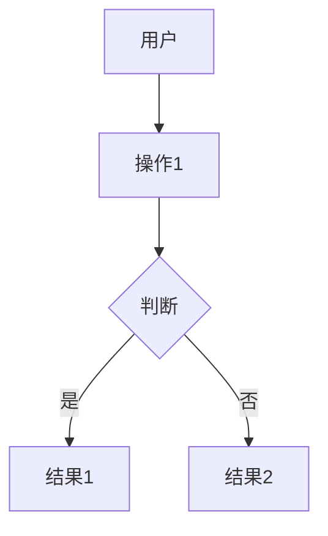

# 需求文档模板

> 存储路径：tasks/pipeline/{PIPELINE-ID}/01-requirement.md
> 由 product-manager 创建

---

## 基本信息

| 属性 | 值 |
|------|-----|
| 文档编号 | REQ-{YYYYMMDD}-{NNN} |
| 需求编号 | PIPELINE-{YYYYMMDD}-{NNN} |
| 需求名称 | {需求名称} |
| 产品经理 | {PM姓名} |
| 创建时间 | {时间} |

---

## 背景

{为什么要做这个需求？解决什么问题？用户痛点是什么？}

---

## 业务价值

| 维度 | 评分(1-10) | 说明 |
|------|-------------|------|
| 用户价值 | X | {说明} |
| 商业价值 | X | {说明} |
| 技术价值 | X | {说明} |

---

## 功能列表

### 功能1：{功能名称}

**描述**：{功能描述}

**用户场景**：
1. 用户进入{页面}
2. 用户执行{操作}
3. 系统{响应}

**验收标准**：
- [ ] {标准1}
- [ ] {标准2}

### 功能2：{功能名称}

**描述**：{功能描述}

**验收标准**：
- [ ] {标准1}

---

## 用户流程

---

## 非功能要求

| 类型 | 要求 |
|------|------|
| 性能 | {响应时间<XX秒} |
| 安全 | {要求} |
| 兼容性 | {要求} |
| 可用性 | {要求} |

---

## 优先级评估

| 维度 | 评分(1-10) | 权重 |
|------|-------------|------|
| 业务价值 | X | 40% |
| 紧急程度 | X | 30% |
| 技术可行性 | X | 30% |

**综合优先级**：P0 / P1 / P2

---

## 给架构师的任务

### 需要设计的模块

1. {模块1} - {说明}
2. {模块2} - {说明}

### 特殊要求

- {要求1}
- {要求2}

---

## 相关文档

- 原型图：{链接}
- 参考资料：{链接}

---

## 审核记录

| 版本 | 时间 | 审核人 | 意见 |
|------|------|--------|------|
| v1.0 | - | - | - |

---

最后更新：2026-04-03