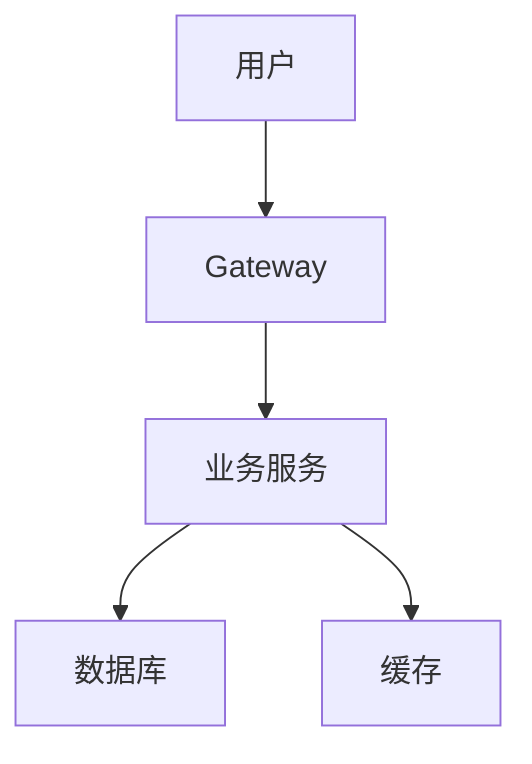
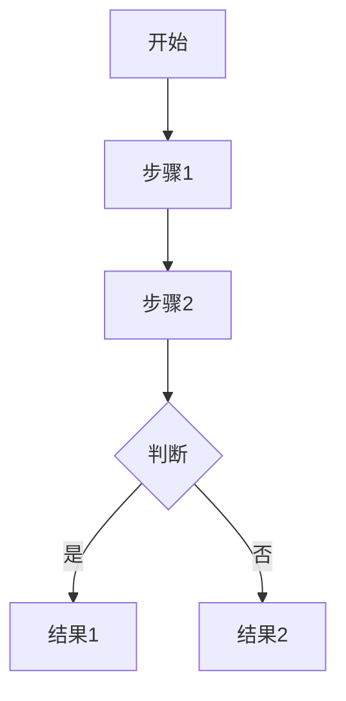

# 技术方案模板

> 存储路径：tasks/pipeline/{PIPELINE-ID}/02-design.md
> 由 architect 创建

---

## 基本信息

| 属性 | 值 |
|------|-----|
| 文档编号 | TECH-{YYYYMMDD}-{NNN} |
| 需求编号 | PIPELINE-{YYYYMMDD}-{NNN} |
| 需求名称 | {需求名称} |
| 架构师 | {架构师姓名} |
| 设计时间 | {时间} |

---

## 业务理解

{对产品需求的理解和消化}

---

## 总体架构



---

## 模块设计

| 模块 | 职责 | 技术选型 | 负责人 |
|------|------|----------|--------|
| {模块1} | {职责} | {技术} | backend-dev |
| {模块2} | {职责} | {技术} | frontend-dev |

---

## 数据库设计

```sql
-- 表1：{表名称}
CREATE TABLE {table_name} (
    id BIGINT PRIMARY KEY AUTO_INCREMENT COMMENT '主键',
    {column_name} {type} COMMENT '字段说明',
    create_time DATETIME DEFAULT CURRENT_TIMESTAMP COMMENT '创建时间',
    update_time DATETIME DEFAULT CURRENT_TIMESTAMP ON UPDATE CURRENT_TIMESTAMP COMMENT '更新时间',
    del_flag CHAR(1) DEFAULT '0' COMMENT '删除标志'
) COMMENT='{表说明}';

-- 索引
INDEX idx_{column} ({column});
```

---

## 接口设计

### 接口1：{接口名称}

| 属性 | 值 |
|------|-----|
| 方法 | GET/POST/PUT/DELETE |
| 路径 | /api/xxx |
| 认证 | 需要/不需要 |

**请求参数**：
```json
{
  "field1": "string required",
  "field2": "number optional"
}
```

**响应参数**：
```json
{
  "code": 200,
  "msg": "操作成功",
  "data": {}
}
```

---

## 核心逻辑

### {逻辑名称}

**流程**：


---

## 技术选型

| 类型 | 选择 | 说明 |
|------|------|------|
| 框架 | {框架} | {说明} |
| 中间件 | {中间件} | {说明} |
| 第三方库 | {库} | {说明} |

---

## 风险评估

| 风险 | 等级 | 影响 | 应对措施 |
|------|------|------|----------|
| {风险1} | 中 | {影响} | {措施} |

---

## 开发计划

| 模块 | 负责人 | 工时(h) | 开始时间 | 完成时间 |
|------|--------|---------|----------|----------|
| 后端接口 | backend-dev | X | - | - |
| 前端页面 | frontend-dev | X | - | - |

**总工时**：X小时

---

## 验收标准

{基于需求文档的验收标准}

---

## 审核记录

| 版本 | 时间 | 审核人 | 意见 |
|------|------|--------|------|
| v1.0 | - | - | - |

---

最后更新：2026-04-03